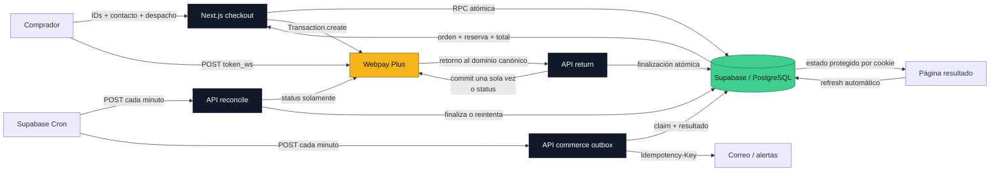
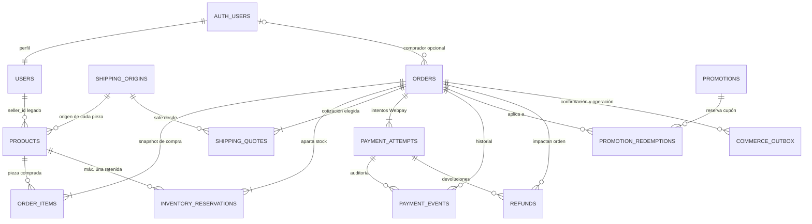
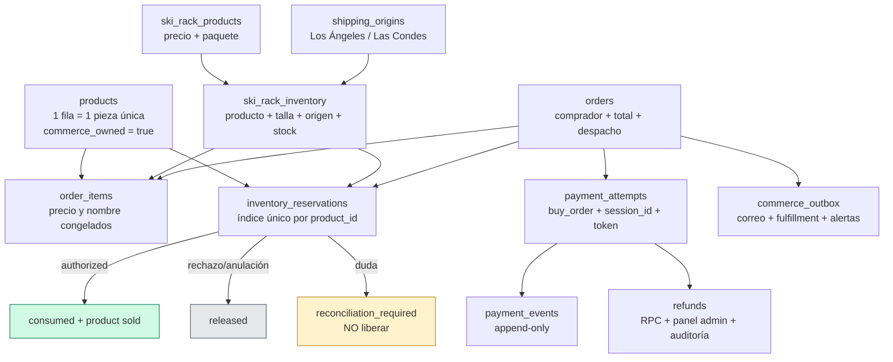
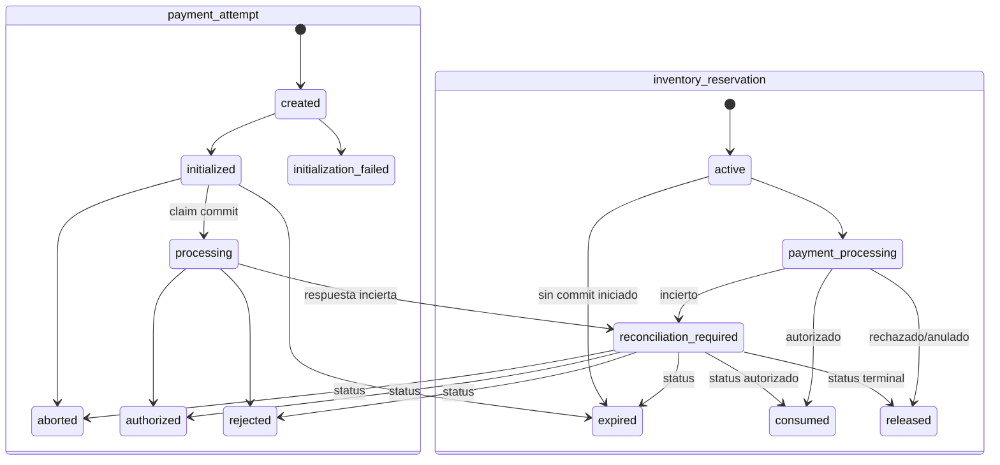

# Mapa visual: producto, orden y pago

Estado local después de las seis migraciones hasta `202608180002`.

## Flujo completo



## Relaciones de base de datos



## Centro del modelo



## Estados coordinados



## Regla de confianza

```text
Navegador: producto + datos de entrega
      │
      ├── nunca decide precio, descuento, despacho o estado de pago
      ▼
PostgreSQL: orden + stock + snapshots
      │
      ├── solo acepta AUTHORIZED + response_code 0 + correlación exacta
      ▼
Transbank: autoridad del pago; aloja tarjeta y autenticación bancaria
```
